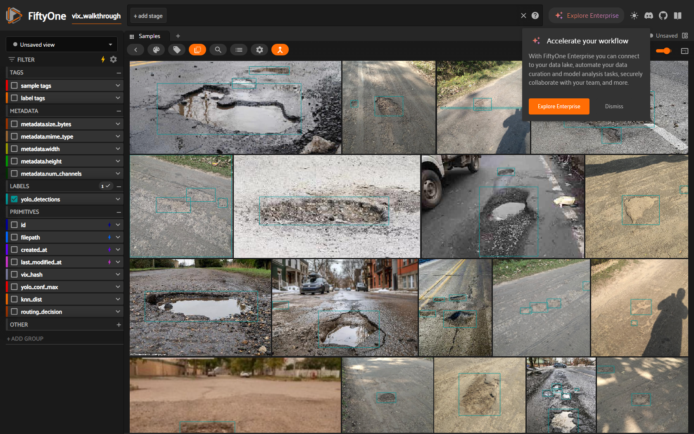
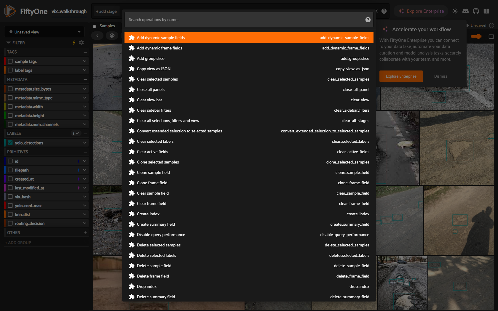
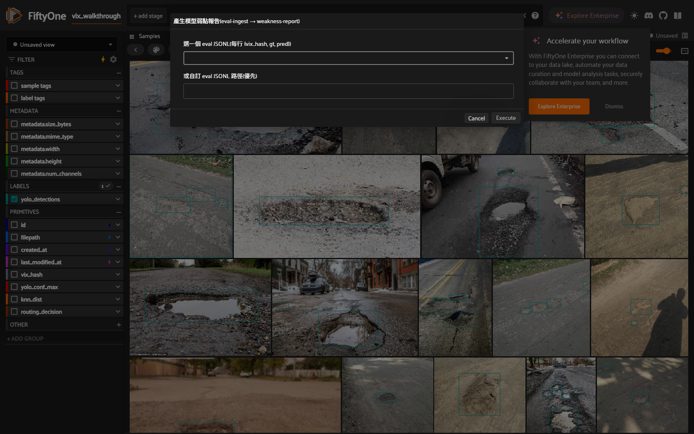
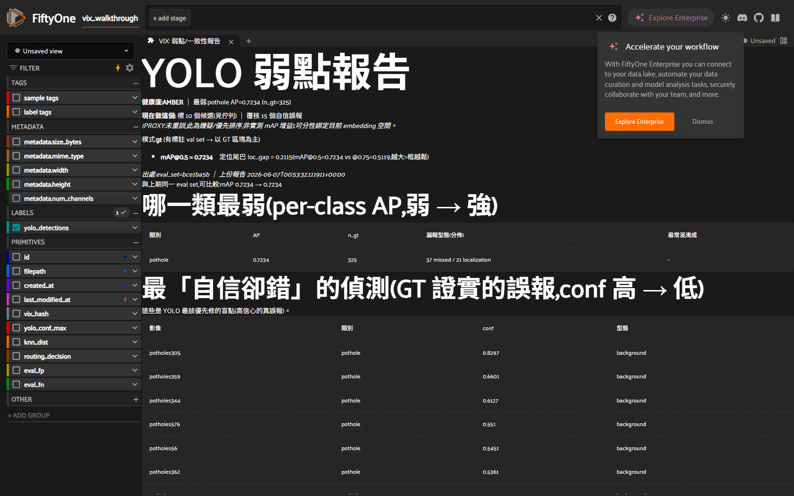
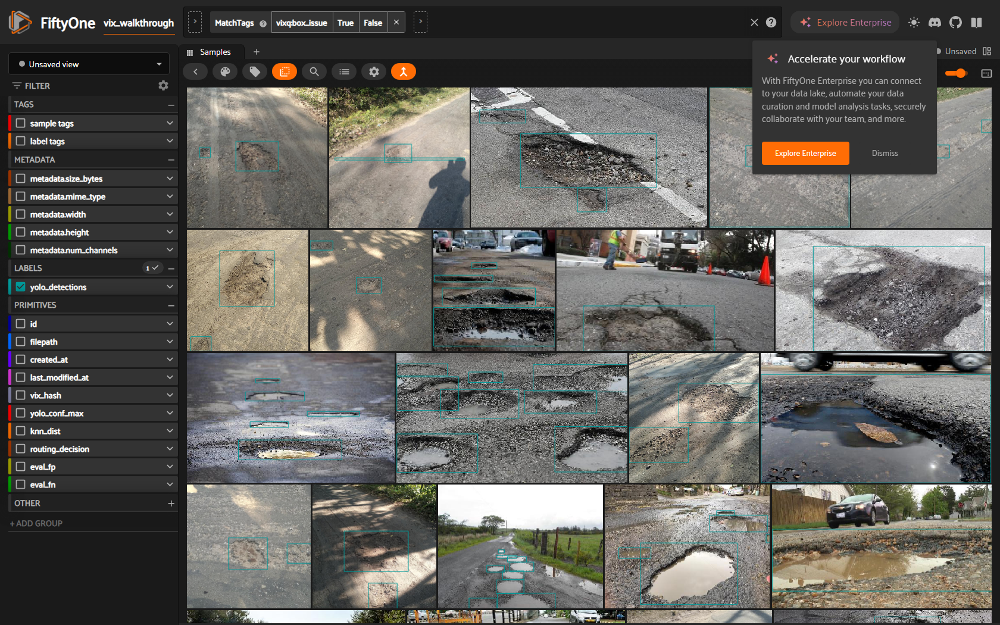
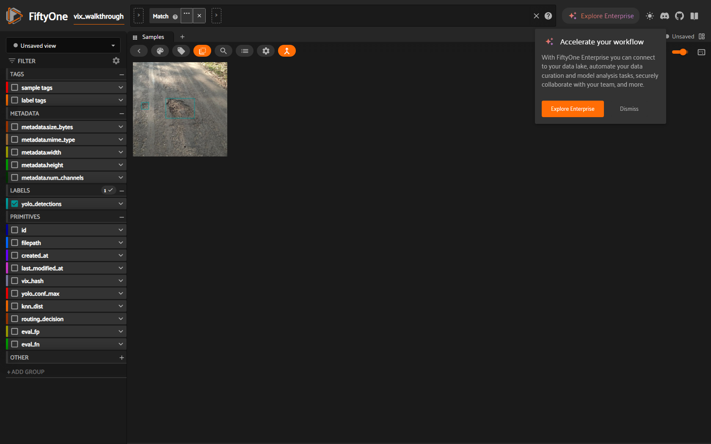
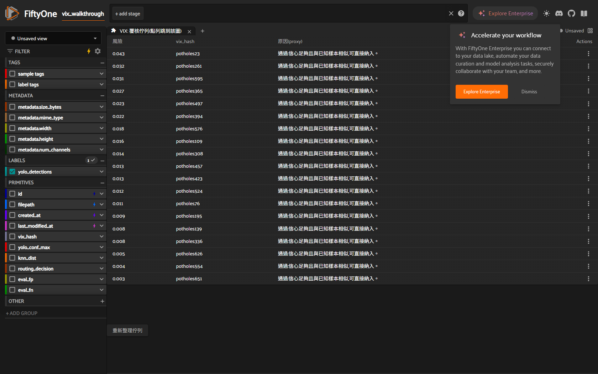
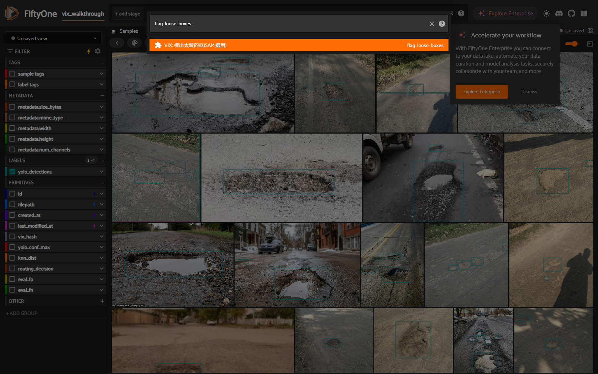
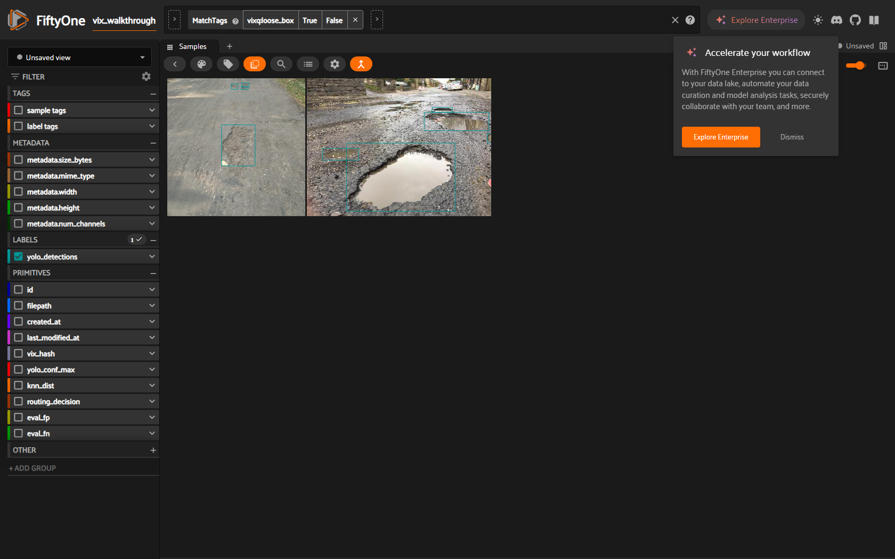

# VIX 在 FiftyOne App 的操作走查(Playwright 實機截圖)

> 全部在**真 patHole 資料 + 真訓練的 YOLOv8n** 上、由 Playwright 驅動 live App 一步一步截下來的。可重現:`python docs/examples/dogfood_walkthrough.py`(需先 `dogfood_train_yolo.py`)。
>
> 誠實說明:(1) 有表單的 operator(產生報告)截「表單畫面」證明可選,效果用它**同一支** `pipeline.*` 套用;無表單的 `flag_label_issues` 同理用同一支 pipeline 套用。(2) 為了示範「抓不準的標註」,**故意種了 4 個壞框**(退化/極端長寬/超大),其餘為真標註。每個關鍵步驟都另有非視覺交叉驗證(eval_results.json 寫出、vixq tag 數、hash 鏈完整)。

---

### 1. 你的資料:真 pothole 影像 + GT/預測框

### 2. 所有 VIX 動作的入口:operator browser(按 `` ` ``)

## 目標一:用「選的」產生模型弱點報告

### 3. 選 `VIX: 產生模型弱點報告(選 eval)` → 下拉選一個 eval JSONL

下拉自動列出 workspace 裡的 eval 檔(每行 `{vix_hash, gt, pred}`),也可填自訂路徑。= CLI 的 `vix eval-ingest` + `vix weakness-report`,但用選的。

### 4. 報告直接在 App 內呈現(真實 mAP / 最弱類別 / 自信卻錯)

`VIX: 弱點/一致性報告` 面板:per-class AP、**最「自信卻錯」**(GT 證實的高信心誤報)、健康度、PROXY 誠實標記。本次真實值 **mAP@0.5=0.7234**。(交叉驗證:`eval_results.json` 已寫出。)

## 目標二:容易看出哪些標註不準、要調整

### 5. 選 `VIX: 標出疑似不準的標註`

一鍵跑 `audit_labels`(疑似標錯類別)+ `box_qa`(框幾何:退化/截邊/面積·長寬離群),把問題影像打 `vixq:label_suspect` / `vixq:box_issue`。

### 6. 篩出「疑似不準標註」工作清單

頂端 view bar 已套 `MatchTags vixq:box_issue` —— 格狀只剩被標記的影像。本次:種了 4 個壞框,VIX 共標出 **28 張**(4 個種的 + 24 個真實面積/長寬離群)。

### 7. 點進一張,直接看到那個不準的框

### 8. 一站式:可點的覆核佇列(點列跳到該圖 + 就地 confirm/dismiss)

`VIX: 覆核佇列` 面板:按風險排序的 風險 / vix_hash / 原因(proxy) 表,列動作 看圖 / 確認→golden / 誤報排除 —— 整個覆核迴圈在一個面板內完成。

## 進階(選用):SAM 框緊度 —— box_qa 做不到的像素級檢查

### 9. `VIX: 標出太鬆的框(SAM,選用)`

`box_qa` 只看框的幾何(退化/離群);這個用 SAM 遮罩檢查框有沒有**像素級貼合**物件,抓「框畫得鬆/沒對齊」。需 ultralytics SAM 權重(一次下載)。

### 10. 太鬆的框工作清單

套 `vixq:loose_box` 篩出 SAM 判定框沒貼合物件的影像。PROXY(SAM 也是猜的),需人工覆核、勿自動改框;不規則物件(如 pothole)框本來就難完全貼合,可調低 IoU 門檻只留最鬆的。

---

**這份走查回答了你的兩個問題**:目標一(步驟 3–4)= 在 GUI 用選的產生模型弱點報告;目標二(步驟 5–7)= 一鍵標出、篩選、點開疑似不準的標註。**侷限**:`box_qa` 抓「框幾何不對」、`audit_labels` 抓「類別標錯」(單類別 pothole 下後者通常為 0);抓「框畫得鬆但形狀正常(像素級不貼合)」需 opt-in 的 SAM —— 尚未納入。
